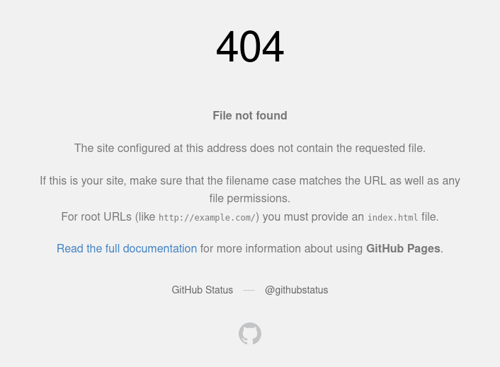

# Creando mi propio Static Site Generator - 05

Este es un post extra hablando de algunas funciones que no estaban planeadas
para crear el Static Site Generator, pero que mejoran la `developer experience`
y la experiencia de los usuarios.

## Seleccionar URL base

Al probar los templates y estilos de forma local, es necesario que los headers
de estilos apunten a una URL local (o hacer un cambio de CORS). Sin embargo, en
la versión final, deben apuntar a la URL de nuestra Web.

Para evitar modificar manualmente el template según el entorno, añadí la opción
de ejecutar el programa con un flag que determina si se debe usar la URL local o
la de la Web.

```ts
// main.ts
const URL = [
  "http://nicolas-sabbatini.github.io", // URL local
  "https://nicolas-sabbatini.github.io", // WEB
];
let SELECTED_URL = 0; // Por defecto siempre se apunta a local
if (Deno.args[0] === "prod") {
  SELECTED_URL = 1;
}

/*
	Se omite mucho código
*/

// Cuando se ejecuta el template
template({ content, base_url: URL[SELECTED_URL] }),
```

```html
<!--Template-->
<link
  rel="stylesheet"
  href="{{base_url}}/assets/styles.css"
>
```

## Hot Reloading

Al probar los templates y estilos de forma local era necesario volver a ejecutar
el builder manualmente para ver las modificaciones en los archivos finales.

Para evitar esto, creé una pequeña función que utiliza
[Deno.watchFs](https://docs.deno.com/api/deno/~/Deno.watchFs) para detectar
cambios en la bóveda, los templates y estilos, y reejecutar automáticamente el
builder, asegurando que siempre tengamos disponible la version más reciente de
nuestra Web.

```ts
buildWeb();
const watcher = Deno.watchFs([".", VAULT_PATH], { recursive: true });
for await (const event of watcher) {
  if (
    event.kind !== "any" && event.kind !== "other" && event.kind !== "access"
  ) {
    template = Handlebars.compile(
      Deno.readTextFileSync("./template/base.html"),
    );
    buildWeb();
  }
}
```

## Git hooks

Al poder cambiar dinámicamente la URL de estilos se abre la posibilidad de que
al finalizar con las modificaciones de nuestra WEB, nos olvidemos de buildear
nuestro proyecto o nos olvidemos de utilizar las flags correctas en dicho
proceso.

Para evitar esto tenemos 2 opciones, utilizar `GitHub actions` o algún servicio
parecido para construir nuestra WEB en la `"nube"` o crear un
[Git hook](https://git-scm.com/book/en/v2/Customizing-Git-Git-Hooks).

Como este es un proyecto chico y solo yo voy a estar modificando el repositorio
voy a estar optando por la segada opción.

Para esto simplemente creamos un archivo llamado `pre-commit` dentro del
directorio `.git/hooks`, en el podemos escribir comandos arbitrario que Git va a
ejecutar antes de realizar la acción de `commit`.

Para nuestro proyecto los siguientes comandos es suficiente.

```bash
# Seleccionamos la shell para ejecutar nuestros comandos
#!/bin/sh

# Nos movemos al directorio de nuestro publisher
cd publisher
# Ejecutamos nuestro proyecto de DENO con las variables correctas
deno run --allow-all main.ts prod
# Volvemos a la carpeta anterior
cd ..
# Añadimos nuestra el directorio de salida al commit
git add docs
return 0
```

## 404

Si algún usuario intenta acceder a una página que no existe dentro de nuestra
web este se va a encontrar con la pantalla de error 404 genérica de GitHub.



Para crear nuestra propia página de error 404, tenemos que crear en el
directorio de nuestro blog un archivo llamado `404.html`, y en el escribir el
coódigo de nuestra página.

```html
<html lang="es-AR">
  <head>
    <!--Meta data de render-->
    <meta charset="UTF-8">
    <meta name="viewport" content="width=device-width, initial-scale=1.0">

    <!--Título de la página-->
    <title>404 Upss</title>

    <!--SEO-->
    <meta
      name="description"
      content="Upssss..."
    >
    <meta name="keywords" content="404">
    <meta name="author" content="CoffeeBreak">
    <meta name="robots" content="index, follow">

    <!--Favicon-->
    <link
      rel="icon"
      type="image/svg+xml"
      href="http://nicolas-sabbatini.github.io/assets/favicon.svg"
    >

    <!--Tarjetas para redes sociales-->
    <meta
      property="og:title"
      content="404 - Upssss..."
    >
    <meta
      property="og:description"
      content="Está página no existe ¿Sera algo temporal o permanente?."
    >
    <meta
      property="og:url"
      content="http://nicolas-sabbatini.github.io/404.html"
    >
    <meta property="og:type" content="website">

    <meta name="twitter:card" content="summary_large_image">
    <meta
      name="twitter:title"
      content="404 - Upssss..."
    >
    <meta
      name="twitter:description"
      content="Está página no existe ¿Sera algo temporal o permanente?."
    >

    <!--Estilos-->
    <link
      rel="stylesheet"
      href="http://nicolas-sabbatini.github.io/assets/styles.css"
    >

    <!--Fuentes-->
    <link rel="preconnect" href="https://fonts.googleapis.com">
    <link rel="preconnect" href="https://fonts.gstatic.com" crossorigin="">
    <link
      href="https://fonts.googleapis.com/css2?family=Roboto+Mono:ital,wght@0,100..700;1,100..700&amp;display=swap"
      rel="stylesheet"
    >
  </head>
  <body>
    <div class="header">
      <div class="header-left">
        <a href="/" class="page-title">CoffeeBreak</a>
      </div>
      <div class="header-center">
        <a href="http://nicolas-sabbatini.github.io/blog" class="page-title"
        >404</a>
      </div>
      <div class="header-right"></div>
    </div>
    <div class="content">
      <h1>
        404 - Upssss...
      </h1>
      <div class="footer">
        <a href="javascript:history.back()" class="footer-left">Volver</a>
      </div>
    </div>
  </body>
</html>
```
